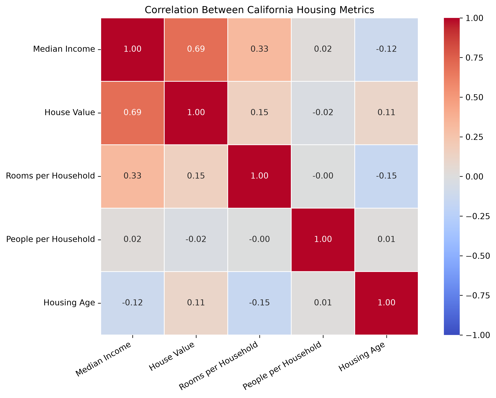
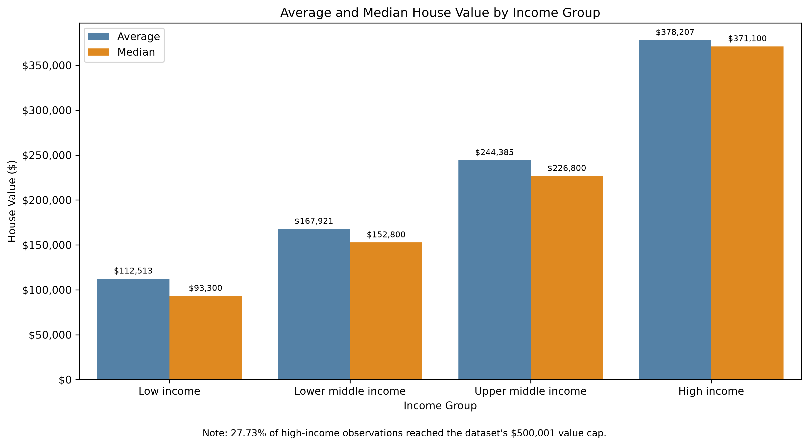
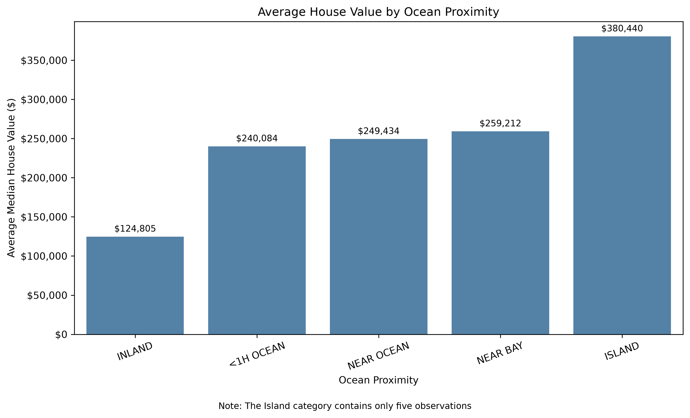
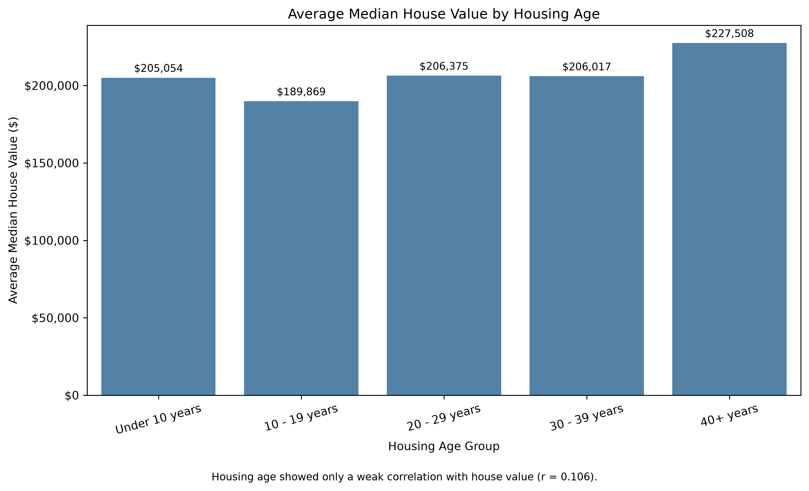

# California Housing Analysis

## About

I made this project to practice using Python and SQL together on one dataset. I worked with 20,640 California housing records and looked at how income, location, and housing age related to median house values.

I first cleaned the CSV with pandas, imported the cleaned data into PostgreSQL, wrote SQL queries to explore it, and then used Matplotlib and Seaborn to create the charts.

## Tools

* Python and pandas
* PostgreSQL and pgAdmin
* SQL
* Matplotlib
* Seaborn

## Cleaning the Data

I standardized the column names, replaced unknown values, converted the numerical columns to the correct data types, and saved a cleaned version of the CSV.

There were 207 missing values in `total_bedrooms`. I decided to keep those records because the other columns were still usable.

## What I Analyzed

In PostgreSQL, I checked the imported row count and missing values before starting the analysis. I then compared house values based on ocean proximity, income group, and housing age.

I also created a view called `property_metrics`, which included calculated columns such as rooms per household and people per household.

## What I Found

Income had the clearest relationship with house value. The correlation between median income and median house value was **0.688**.

Average house values also increased across each income group. Low-income areas averaged about **$112,513**, while high-income areas averaged about **$378,207**.

Location also made a large difference. Inland areas averaged **$124,805**, compared with **$259,212** for areas near the bay.

The Island category had the highest average, but it only had five records, so I did not treat it as a reliable overall result.

Housing age had a much weaker relationship with value. The correlation was only **0.106**. One thing I noticed was that the oldest housing group had the highest average value, but many of those records were also located closer to the ocean.

## Limitations

The dataset had 207 missing bedroom values. It also capped median house values at **$500,001**. A total of 965 records reached that cap, so some of the most expensive areas may have had higher true values.

The Island group was also very small, with only five records.

## Files

* `scripts/data_cleaning.py` cleans the original CSV.
* `scripts/create_visualizations.py` creates the charts.
* `SQL/california_housing_analysis.sql` contains my SQL queries.
* `Data` contains the raw and cleaned datasets.
* `Images` contains the four finished charts.

## Takeaway

The main thing I learned from this project was that income and ocean proximity had much stronger relationships with house value than housing age or household size.
